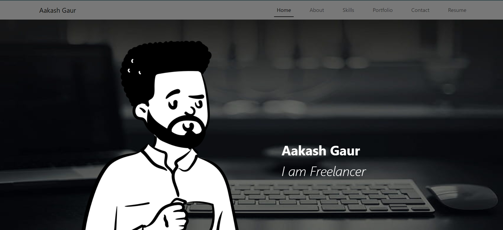
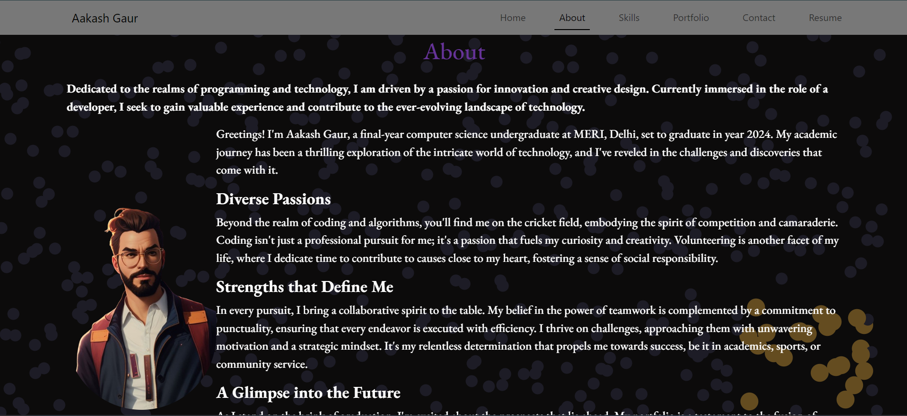
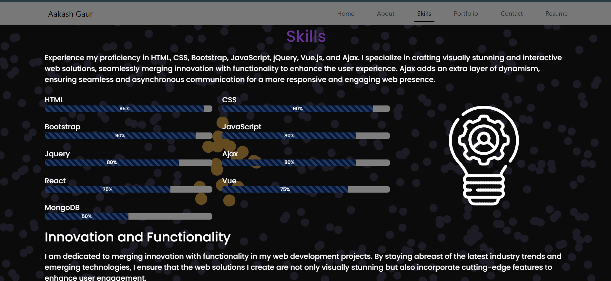
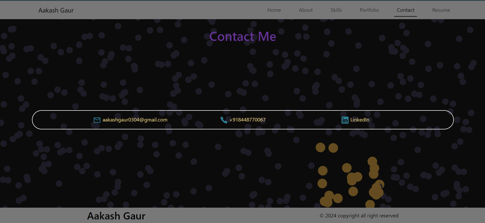

# Portfolio Website

Check out the live website: [Portfolio Website](https://aakash-gaur-portfolio.netlify.app/)


Welcome to my Portfolio Website! This React-based project showcases my skills, portfolio, and contact details, and allows you to download my resume.


## Images








## Features

- **About Me**: Learn more about who I am and my background.
- **Portfolio**: View my projects and work samples.
- **Skills**: Discover the skills and technologies I specialize in.
- **Contact**: Get in touch with me via contact details provided.
- **Resume Download**: Download my resume directly from the site.

## How to Use

1. Clone the repository to your local machine:
    ```bash
    git clone https://github.com/AakashGaur03/portfolio_website_react
    ```

2. Navigate to the project directory:
    ```bash
    cd portfolio_website_react
    ```

3. Install dependencies:
    ```bash
    npm install
    ```

4. Start the development server:
    ```bash
    npm run dev
    ```

5. Open your web browser and visit `http://localhost:3000` to view your portfolio website.


## Customization

Feel free to customize the website by modifying the components, styles, and content according to your needs.

## Contributing

If you would like to contribute to the project, please fork the repository and submit a pull request. All contributions are welcome!


Thank you for visiting my portfolio!